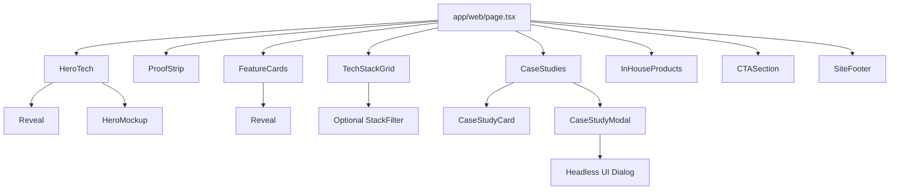
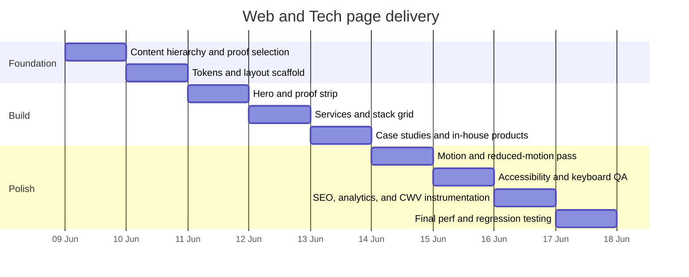

# Designing a Cohesive, High-Impact Web and Tech Page for SeeTusk

## Executive summary

The current `dev.seetusk.com` site already has the right strategic bones for a strong Web & Tech page. The existing `/web` page has a sharp business proposition, a deliberately small stack, productized service offers, analytics-minded positioning, and in-house product proof. The homepage reinforces the same brand stance with strong editorial copy, chapter-like sectioning, and “studio floor / signal” language. What is missing is not positioning; it is visual intensity, scan-friendly componentization, stronger proof density, and a more memorable hero moment that makes “Web & Tech” feel like a flagship capability rather than a well-written text page. citeturn25view1turn37view0turn25view0

The most cohesive direction is not “generic SaaS landing page.” It is a **Signal Console** theme: editorial and cinematic like the current site, but structured like a modern product page. That direction comes directly from the language already on the site, including “distribution signal live,” “selected signals from the studio floor,” “Vertical 03 / Build,” and “Boring where it should be. Sharp where it counts.” In practice, that means a restrained dark canvas, current brand accents preserved as-is, typography-first layouts, high-contrast cards, browser or device mockups, subtle grid and noise textures, and motion that feels like systems booting up rather than decorative showmanship. citeturn25view0turn37view0

From an implementation standpoint, the safest and highest-performing stack is **Next.js App Router with Server Components by default**, with small, isolated Client Components only where interaction or browser APIs are needed. For animation, use **Motion for React** only where CSS transitions are no longer enough: section reveals, viewport-triggered entrances, shared-layout transitions, and gesture polish. Motion itself recommends CSS for simple self-contained effects and is best used when animation needs scale, layout awareness, gestures, or state-driven orchestration. Next.js likewise recommends defaulting to Server Components and introducing Client Components only when state, events, lifecycle logic, or browser APIs are required. citeturn35view4turn32view0turn34view0

The page should also be production-ready from day one: route metadata and OG images through Next’s Metadata API, image optimization through `next/image`, font optimization through `next/font`, Core Web Vitals reporting through `useReportWebVitals`, and acquisition plus behavior tracking through GA4 and PostHog. That fits the current page’s own promise of building for “speed, SEO, and conversion” and its explicit mention of PostHog, GA4, and Segment in the stack. citeturn25view1turn37view0turn35view0turn35view1turn35view2turn35view3turn29search1turn29search3turn29search7

A realistic implementation estimate for a polished first release is **about 38 to 50 hours**, assuming copy and case-study assets already exist. If final copy, screenshots, or case-study visuals still need to be produced, add another **6 to 12 hours**.

| Area | Recommended decision |
|---|---|
| Page concept | **Signal Console** |
| Visual direction | Editorial typography + product-page modularity |
| Motion | Transform and opacity only; subtle, responsive, reduced-motion safe |
| Stack | Next.js App Router + Tailwind + Motion for React + Headless UI where needed |
| Proof strategy | Outcome metrics, trust strip, stack grid, case study modules, in-house products |
| Delivery target | One production-ready route with SEO, analytics, accessibility, and CWV instrumentation |

## Current site audit

The audited structure is highly consistent. The homepage uses a strong all-caps hero, short declarative body copy, chapter markers, a service block that includes Web & Tech, a featured-work section, and studio-language motifs such as “strategy locked,” “creative system online,” and “distribution signal live.” The current `/web` page follows the same editorial rhythm with “Vertical 03 / Build,” a concise H1, a stack section, a services section, in-house product cards, newsletter copy, and a compact footer. This consistency is valuable: the new page should feel like a **more productized expression of the same brand**, not a stylistic detour. citeturn25view0turn25view1turn37view0

The strongest existing qualities are clarity and discipline. The `/web` page states the value proposition in one line, defines the build stack in business terms, distinguishes service categories clearly, and ties web work to measurement, speed, SEO, and conversion. It also already signals modern architecture with Next.js, React, TypeScript, Shopify Hydrogen, CMS options, Vercel or Cloudflare or AWS, and analytics tooling. That is excellent raw material for a visually richer page. citeturn25view1turn37view0

The biggest gap is **scannability at speed**. Right now, much of the page is still presented as stacked text blocks. Stack entries, service offers, and products read well, but they do not yet behave like a premium tech page with clear card hierarchy, proof anchors, visual rhythm changes, or interaction cues that guide the eye. The page also underuses outcome proof: there are prices and product names, but very few hard metrics, screenshots, architecture diagrams, or before-and-after signals. citeturn37view0

Accessibility-wise, the audit shows a mixed picture. There is meaningful sectioning and descriptive copy, which is good. But the homepage crawl also exposes many images with only the fallback label “Image,” which suggests that at least some visuals may lack descriptive alt text. The brand lockup is parsed as separated letterforms (“S eetusk,” “C reative,” “A gency”), which could create an awkward reading order if the visual treatment is not backed by a consolidated accessible name. The stack section also includes decorative arrow bullets (`* ->`) that should be hidden from assistive tech if purely ornamental. These are all fixable and should be addressed as part of the redesign. WCAG 2.2 remains the best benchmark, requiring at least **4.5:1** contrast for normal text, **3:1** for large text, visible focus, and safe handling of motion from interactions. citeturn25view2turn37view0turn14search0turn17view1turn13search2turn13search5turn14search1turn14search5

Performance-wise, I did not run a full Lighthouse trace in this environment, so the concerns below are structural rather than measured. The site is image-heavy, and the homepage includes many logos and visuals in sequence; the page copy also implies pointer- or motion-led interaction on the homepage. The redesign should therefore assume that the largest above-the-fold visual is an LCP candidate, that image dimensions must be reserved to prevent CLS, and that motion should stay transform- and opacity-based so interaction latency does not degrade INP. Next.js and web.dev both strongly support that approach. citeturn25view0turn25view2turn22search8turn23search0turn35view2turn35view4

| Dimension | What to preserve | What to improve |
|---|---|---|
| Layout | Long-form chapter rhythm, editorial pacing, studio language | Add modular visual beats, proof strips, and card-based scan paths |
| Color palette | Keep current brand colors unchanged | Formalize them as semantic tokens and add translucent surfaces and borders |
| Typography | Big editorial headlines and sharp business copy | Create a repeatable scale for H1, H2, card titles, captions, and meta labels |
| Spacing | Airy section separation and short content blocks | Standardize section, card, and inline spacing for more consistency |
| Components | Stack section, service offers, product cards, footer structure | Rebuild as premium reusable cards with hover and reveal states |
| Accessibility | Good macro structure, clear headings | Fix generic image alts, lockup semantics, focus styles, and reduced-motion behavior |
| Performance | Strong opportunity for a fast route | Treat images, animation, and client JS as performance-sensitive from the start |

## Inspiration analysis

The most useful references are pages that balance product credibility, restrained motion, and highly legible modular sections. The current live references worth studying are **Vercel**, **Stripe**, **Supabase**, and **Linear**. Their official pages are here: Vercel citeturn30search0, Stripe citeturn30search1, Supabase citeturn30search2, and Linear citeturn30search3.

| Reference | What it does well | What to borrow for SeeTusk | What not to copy literally |
|---|---|---|---|
| Vercel | Strong proof snippets, category entry points, concise CTA structure | A proof strip under the hero, category chips, and “results-first” micro-panels | Generic cloud-brand minimalism without studio character |
| Stripe | Monumental hero, trust logos, vivid gradient energy, strong product framing | A high-drama hero backdrop and a polished browser/device mockup | Overly bright gradient dominance that could dilute SeeTusk’s editorial tone |
| Supabase | Modular platform framing, stack clarity, dark product cards | A highly scannable stack grid and capability modules | Developer-tool density that feels too infrastructure-centric |
| Linear | Precision copy, whitespace, speed/focus framing, calm polish | Cleaner feature cards, better hierarchy, more breathing room | Too much softness; SeeTusk should stay more cinematic and textured |

There are four patterns that repeat across these references and fit SeeTusk especially well. First, **proof appears early** rather than being deferred; Vercel exposes customer outcomes high on the page, Stripe pairs its headline with customer and scale signals, Supabase shows logos early, and Linear frames its value with product-participation language right away. Second, the best pages turn platform complexity into **modular cards**, which is exactly what SeeTusk’s current stack and services content needs. Third, they all rely on **clear visual hierarchy** rather than many interaction gimmicks. Fourth, the motion is generally in service of focus and clarity, not novelty. citeturn30search0turn30search1turn30search2turn30search3

The synthesis for SeeTusk is this: borrow **Vercel’s proof cadence**, **Stripe’s hero drama**, **Supabase’s capability grid**, and **Linear’s whitespace discipline**, then filter all of it through SeeTusk’s own “studio / signal / distribution” language. That keeps the page aligned with the current site instead of making it feel imported. citeturn25view0turn37view0turn30search0turn30search1turn30search2turn30search3

## Recommended visual and motion system

The recommended theme is **Signal Console**. Visually, it should feel like a hybrid of an editorial studio deck and a polished product page: dark base layers, warm or cinematic text contrast, current brand accent preserved, glass-like elevated surfaces, faint grid lines, restrained glow, and a browser-UI or architecture-UI motif near the hero. The site already uses “signal,” “studio floor,” “built in-house,” and “typography-first” language; the visual system should simply make that language visible. citeturn25view0turn37view0

Because the crawl did not expose compiled CSS or exact rendered color values, the safest move is to keep all current brand colors as-is and formalize them into semantic tokens. Tailwind supports theme variables and a responsive utility workflow that makes this tokenization practical and maintainable. Its font-size and breakpoint systems are already well-suited for turning a design system into predictable utility classes. citeturn36view0turn36view1

### Visual system

| Token | Purpose | Recommendation |
|---|---|---|
| `canvas` | Page background | Map to current site’s darkest surface |
| `surface` | Cards and content panels | `canvas` plus a subtle luminance lift |
| `surface-2` | Hover or active surfaces | Slightly brighter than `surface` |
| `text` | Primary headings and key body copy | Map to current main text color |
| `muted` | Secondary copy and labels | About 70–75% of `text` contrast |
| `line` | Dividers and card borders | Thin, low-contrast borders at 10–14% opacity |
| `accent` | Primary CTA, active chips, glows | Current site primary accent |
| `accent-quiet` | Hover fills and glows | `accent` at 12–18% alpha |
| `accent-2` | Secondary highlight, charts, badges | Existing secondary accent if present |

| Typography role | Tailwind baseline | Intended use |
|---|---|---|
| Display | `text-5xl md:text-6xl lg:text-7xl` | Hero H1 |
| Section title | `text-3xl md:text-4xl lg:text-5xl` | Major section headings |
| Card title | `text-xl md:text-2xl` | Feature and case-study cards |
| Lead body | `text-lg md:text-xl` | Supporting hero copy |
| Standard body | `text-base md:text-lg` | Long-form section copy |
| Meta label | `text-xs md:text-sm uppercase tracking-[0.2em]` | Eyebrows, categories, chapter markers |
| Caption | `text-sm` | Badge copy, visual labels, stack notes |

The spacing system should stay simple and predictable: **4, 8, 12, 16, 24, 32, 48, 64, 96** as the core unit ladder. Use `24/32` inside cards, `48/64` between major blocks, and `96` around the hero on large screens. That gives the page the calm, premium spacing seen in the strongest tech references while staying true to the current site’s broad editorial pacing. Use line icons with a thin stroke, avoid filled multicolor icon sets, and favor real product screens, studio stills, browser chrome mockups, and restrained abstract textures over generic stock illustrations. citeturn30search0turn30search2turn30search3turn25view0turn37view0

### Motion system

Motion should feel like **systems coming online**. The right vocabulary is fade-up, scale-in, soft border glow, cursor-safe hover lift, chip transitions, and a progress-line or reveal-line accent. Motion for React supports the right primitives for this, including `whileHover`, `whileTap`, `whileFocus`, `whileInView`, layout animation, and reduced-motion handling. Headless UI’s data-state attributes also make CSS-driven transitions ergonomic for menus, disclosures, and dialogs. citeturn7search18turn34view1turn34view0turn33view0turn19view0

The accessibility rule is straightforward: if motion is not essential, it must reduce cleanly. W3C guidance for animation from interactions and `prefers-reduced-motion` is clear, and Motion’s `useReducedMotion` hook makes that easy by allowing x or y transforms, autoplay, or parallax to be replaced with opacity-only changes. citeturn14search1turn14search5turn14search7turn34view0

| Motion type | Trigger | Duration | Easing | Reduced-motion fallback |
|---|---|---:|---|---|
| Hero text reveal | Initial render | 320ms | `cubic-bezier(0.22,1,0.36,1)` | Opacity only |
| Hero mockup pop-in | Initial render | 420ms | Spring or soft-out | Opacity only |
| Section reveal | `whileInView` once | 260–360ms | Soft-out | Opacity only |
| Card hover lift | Hover/focus | 140–180ms | Ease-out | Border or shadow only |
| Chip or filter change | Click | 120–160ms | Ease-out | No scale; color change only |
| Case-study modal | Open/close | 180–240ms | Ease-out | Fade only |
| Progress line | Scroll-linked | Continuous | Native / hardware-accelerated where possible | Disable entirely |

A practical motion rule set for this page is: use CSS transitions for color, border, shadow, and small hover polish; use Motion for scroll-triggered entrances, shared-layout transitions, and modals; avoid heavy parallax; and never make information dependent on pointer hover alone. Motion’s own guidance notes that CSS remains the better lightweight choice for simple, self-contained effects, while Motion is valuable when animation complexity increases. citeturn32view0turn34view1

## Component library and React architecture

The current content model already maps neatly into reusable components: hero, proof strip, feature cards, stack grid, case studies, in-house product cards, CTA, and footer. The redesign should codify those components as a small library instead of one-off sections. Tailwind’s responsive variants and grid utilities make that practical without leaving the markup, and the current content structure gives you enough semantic material to populate every component without inventing a new story. citeturn36view0turn36view2turn37view0



| Component | Recommended pattern | Responsive behavior | Tailwind recipe |
|---|---|---|---|
| Hero | Left text, right browser or device mockup, proof row below | Single column on mobile, split layout from `lg` | `grid gap-10 lg:grid-cols-[1.15fr_.85fr] items-end` |
| Feature cards | Four “ways we build” cards with tags, pricing, and CTA | `1 → 2 → 4` columns | `grid gap-4 sm:grid-cols-2 xl:grid-cols-4` |
| Tech stack grid | Capability panels grouped by stack or fit | `1 → 2 → 3` columns | `grid gap-4 md:grid-cols-2 xl:grid-cols-3` |
| Case studies | Large primary card plus smaller supporting cards | Stack on mobile, asymmetric desktop layout | `grid gap-6 lg:grid-cols-[1.1fr_.9fr]` |
| In-house products | Smaller product cards with status badges | `1 → 3` cards | `grid gap-4 md:grid-cols-3` |
| CTA | Big closing panel with concise pitch and strong CTA pair | Vertical on mobile, horizontal on desktop | `rounded-3xl border p-8 md:p-10 lg:flex lg:items-end lg:justify-between` |
| Footer | Compact editorial footer preserving current structure | `1 → 4` columns | `grid gap-8 border-t pt-10 md:grid-cols-4` |

Architecturally, this route should be mostly server-rendered. Next.js defaults pages and layouts to Server Components, which is ideal for a marketing route because it reduces browser JS, improves initial rendering, and supports streaming. Client Components should be isolated to pieces that need state, event handlers, or browser-only APIs. React’s own guidance on state still applies: local state stays local, and any shared UI state should be lifted only to the nearest common parent. citeturn35view4turn7search3turn7search11

| Layer | Server or client | Notes |
|---|---|---|
| `app/web/page.tsx` | Server | Route composition, metadata, content assembly |
| `HeroTech`, `ProofStrip`, `CTASection` | Server | Pure presentational output |
| `Reveal`, `HeroMockup`, `CaseStudyModal`, `StackFilter` | Client | Motion, interaction, and viewport logic |
| `CaseStudyModal` | Client + Headless UI | Use `Dialog` for focus trapping and inert background |
| `WebVitals` | Client | Keep as a small isolated client boundary |
| Content config | Server-safe plain data | Static arrays in `content/web.ts` |

Headless UI is most useful here for the modal or mobile interactions. Its `Dialog` is accessibility-managed, automatically portal-rendered, traps focus, and marks the rest of the page inert while open. Its `Disclosure` and `Transition` APIs also work well with Tailwind state modifiers if you need FAQ, filters, or a compact mobile details panel. citeturn33view1turn33view2turn33view3turn19view0turn33view0

## Code examples

The snippets below assume **Next.js App Router + Tailwind + Motion for React**. Motion is now installed as `motion` and imported from `"motion/react"`, while Headless UI remains a strong choice for accessibility-managed dialogs and disclosures. citeturn32view0turn19view0turn33view1

### Tailwind tokens and brand-safe semantic colors

```ts
// tailwind.config.ts
import type { Config } from "tailwindcss";

export default {
  content: ["./app/**/*.{ts,tsx}", "./components/**/*.{ts,tsx}"],
  theme: {
    extend: {
      colors: {
        canvas: "rgb(var(--canvas) / <alpha-value>)",
        surface: "rgb(var(--surface) / <alpha-value>)",
        surface2: "rgb(var(--surface-2) / <alpha-value>)",
        text: "rgb(var(--text) / <alpha-value>)",
        muted: "rgb(var(--muted) / <alpha-value>)",
        line: "rgb(var(--line) / <alpha-value>)",
        accent: "rgb(var(--accent) / <alpha-value>)",
        accent2: "rgb(var(--accent-2) / <alpha-value>)",
      },
      maxWidth: {
        shell: "80rem",
      },
      borderRadius: {
        "4xl": "2rem",
      },
      boxShadow: {
        soft: "0 12px 40px rgba(0,0,0,0.22)",
      },
      transitionTimingFunction: {
        "out-soft": "cubic-bezier(0.22, 1, 0.36, 1)",
      },
    },
  },
  plugins: [],
} satisfies Config;
```

```css
/* app/globals.css */
:root {
  /* Keep current brand colors; swap only the accents if the live site differs */
  --canvas: 10 10 12;
  --surface: 16 16 20;
  --surface-2: 24 24 30;
  --text: 244 241 235;
  --muted: 182 177 171;
  --line: 255 255 255;
  --accent: 122 92 255;   /* replace with existing brand accent */
  --accent-2: 0 209 178;  /* replace with existing secondary accent if present */
}

html {
  scroll-behavior: smooth;
}

body {
  @apply bg-canvas text-text antialiased;
}

::selection {
  @apply bg-accent/25;
}
```

### Reusable reveal wrapper with reduced-motion support

```tsx
// components/reveal.tsx
"use client";

import { motion, useReducedMotion } from "motion/react";
import type { PropsWithChildren } from "react";

type RevealProps = PropsWithChildren<{
  className?: string;
  delay?: number;
  y?: number;
}>;

export function Reveal({
  children,
  className,
  delay = 0,
  y = 20,
}: RevealProps) {
  const reduceMotion = useReducedMotion();

  return (
    <motion.div
      className={className}
      initial={{ opacity: 0, y: reduceMotion ? 0 : y }}
      whileInView={{ opacity: 1, y: 0 }}
      viewport={{ once: true, amount: 0.2 }}
      transition={{
        duration: 0.32,
        delay,
        ease: [0.22, 1, 0.36, 1],
      }}
    >
      {children}
    </motion.div>
  );
}
```

### Hero component for the new Web and Tech route

```tsx
// components/web-tech-hero.tsx
"use client";

import { motion, useReducedMotion } from "motion/react";
import { Reveal } from "./reveal";

export function WebTechHero() {
  const reduceMotion = useReducedMotion();

  return (
    <section className="relative overflow-hidden px-6 pb-16 pt-28 md:px-8 lg:pb-24 lg:pt-36">
      <div className="absolute inset-0 bg-[radial-gradient(circle_at_top_right,rgba(var(--accent),0.18),transparent_28%),radial-gradient(circle_at_bottom_left,rgba(var(--accent-2),0.12),transparent_24%)]" />
      <div className="absolute inset-0 opacity-20 [background-image:linear-gradient(rgba(255,255,255,.06)_1px,transparent_1px),linear-gradient(90deg,rgba(255,255,255,.06)_1px,transparent_1px)] [background-size:36px_36px]" />

      <div className="relative mx-auto grid max-w-shell items-end gap-12 lg:grid-cols-[1.15fr_.85fr]">
        <div>
          <Reveal>
            <p className="mb-4 text-xs uppercase tracking-[0.28em] text-muted">
              Vertical 03 / Build
            </p>
          </Reveal>

          <Reveal delay={0.05}>
            <h1 className="max-w-[12ch] text-5xl font-semibold leading-none tracking-[-0.04em] md:text-6xl lg:text-7xl">
              Websites, landers, and tools that pay.
            </h1>
          </Reveal>

          <Reveal delay={0.1}>
            <p className="mt-6 max-w-2xl text-lg leading-8 text-muted md:text-xl">
              Copy, design, code, and measurement designed as one system for
              speed, SEO, and conversion. No templates. No bloat. Just sharp
              surfaces built for ambitious brands.
            </p>
          </Reveal>

          <Reveal delay={0.15}>
            <div className="mt-8 flex flex-wrap gap-3">
              <a
                href="#start-project"
                className="inline-flex items-center rounded-full bg-accent px-5 py-3 text-sm font-medium text-white transition hover:scale-[1.02] focus-visible:outline focus-visible:outline-2 focus-visible:outline-offset-2 focus-visible:outline-accent"
              >
                Start a project
              </a>
              <a
                href="#case-studies"
                className="inline-flex items-center rounded-full border border-line/15 bg-white/5 px-5 py-3 text-sm font-medium text-text transition hover:bg-white/10 focus-visible:outline focus-visible:outline-2 focus-visible:outline-offset-2 focus-visible:outline-accent"
              >
                See selected builds
              </a>
            </div>
          </Reveal>

          <Reveal delay={0.2}>
            <div className="mt-10 flex flex-wrap gap-3 text-xs uppercase tracking-[0.22em] text-muted">
              <span className="rounded-full border border-line/15 bg-white/5 px-3 py-2">
                Next.js
              </span>
              <span className="rounded-full border border-line/15 bg-white/5 px-3 py-2">
                Webflow
              </span>
              <span className="rounded-full border border-line/15 bg-white/5 px-3 py-2">
                Shopify Hydrogen
              </span>
              <span className="rounded-full border border-line/15 bg-white/5 px-3 py-2">
                PostHog + GA4
              </span>
            </div>
          </Reveal>
        </div>

        <motion.div
          initial={{ opacity: 0, scale: reduceMotion ? 1 : 0.96, y: reduceMotion ? 0 : 24 }}
          animate={{ opacity: 1, scale: 1, y: 0 }}
          transition={{ duration: 0.45, delay: 0.15, ease: [0.22, 1, 0.36, 1] }}
          className="relative"
        >
          <div className="rounded-[28px] border border-line/15 bg-surface/80 p-3 shadow-soft backdrop-blur">
            <div className="rounded-[22px] border border-line/10 bg-canvas">
              <div className="flex items-center gap-2 border-b border-line/10 px-4 py-3">
                <span className="h-2.5 w-2.5 rounded-full bg-white/20" />
                <span className="h-2.5 w-2.5 rounded-full bg-white/12" />
                <span className="h-2.5 w-2.5 rounded-full bg-white/8" />
                <div className="ml-3 h-8 flex-1 rounded-full bg-white/5 px-4 text-sm leading-8 text-muted">
                  dev.seetusk.com/web
                </div>
              </div>

              <div className="grid gap-4 p-4 md:grid-cols-2">
                <div className="rounded-3xl border border-line/10 bg-white/5 p-5">
                  <p className="text-xs uppercase tracking-[0.22em] text-muted">
                    Signal
                  </p>
                  <h2 className="mt-3 text-2xl font-medium tracking-[-0.03em]">
                    Brand websites
                  </h2>
                  <p className="mt-3 text-sm leading-7 text-muted">
                    Typography-first marketing sites with speed, SEO, and clean
                    ownership built in from day one.
                  </p>
                </div>

                <div className="rounded-3xl border border-line/10 bg-white/5 p-5">
                  <p className="text-xs uppercase tracking-[0.22em] text-muted">
                    Conversion
                  </p>
                  <h2 className="mt-3 text-2xl font-medium tracking-[-0.03em]">
                    Launch landers
                  </h2>
                  <p className="mt-3 text-sm leading-7 text-muted">
                    High-intent pages for campaigns, launches, and lead capture.
                  </p>
                </div>

                <div className="rounded-3xl border border-line/10 bg-white/5 p-5 md:col-span-2">
                  <div className="flex items-center justify-between gap-4">
                    <div>
                      <p className="text-xs uppercase tracking-[0.22em] text-muted">
                        Measurement
                      </p>
                      <h2 className="mt-3 text-2xl font-medium tracking-[-0.03em]">
                        Instrumented from day one
                      </h2>
                    </div>
                    <span className="rounded-full border border-accent/30 bg-accent/10 px-3 py-2 text-xs uppercase tracking-[0.22em] text-accent">
                      PostHog + GA4
                    </span>
                  </div>
                </div>
              </div>
            </div>
          </div>
        </motion.div>
      </div>
    </section>
  );
}
```

### Tech stack grid and service cards

```tsx
// components/tech-stack-grid.tsx
import { Reveal } from "./reveal";

const stack = [
  {
    title: "Next.js / React / TypeScript",
    body: "For custom builds, productized tools, and anything with complex state.",
  },
  {
    title: "Webflow + Framer",
    body: "For marketing control when software complexity is intentionally low.",
  },
  {
    title: "Shopify + Hydrogen",
    body: "For commerce builds that need headless flexibility without reinvention.",
  },
  {
    title: "Sanity / Payload / Notion CMS",
    body: "Content models the marketing team can actually use and maintain.",
  },
  {
    title: "Vercel / Cloudflare / AWS",
    body: "Fast shipping, low overhead, and sane infrastructure decisions.",
  },
  {
    title: "PostHog / GA4 / Segment",
    body: "Acquisition and product-style measurement wired from day one.",
  },
];

export function TechStackGrid() {
  return (
    <section className="px-6 py-16 md:px-8 lg:py-24">
      <div className="mx-auto max-w-shell">
        <Reveal>
          <p className="text-xs uppercase tracking-[0.28em] text-muted">
            Stack & fit
          </p>
          <h2 className="mt-4 max-w-3xl text-3xl font-semibold tracking-[-0.03em] md:text-4xl">
            Boring where it should be. Sharp where it counts.
          </h2>
        </Reveal>

        <div className="mt-8 grid gap-4 md:grid-cols-2 xl:grid-cols-3">
          {stack.map((item, index) => (
            <Reveal key={item.title} delay={index * 0.04}>
              <article className="group h-full rounded-3xl border border-line/12 bg-surface/70 p-6 transition duration-200 ease-out-soft hover:-translate-y-1 hover:border-accent/25 hover:bg-surface2/80">
                <p className="text-xs uppercase tracking-[0.22em] text-muted">
                  Capability
                </p>
                <h3 className="mt-4 text-xl font-medium tracking-[-0.02em] text-text">
                  {item.title}
                </h3>
                <p className="mt-3 text-sm leading-7 text-muted">{item.body}</p>
              </article>
            </Reveal>
          ))}
        </div>
      </div>
    </section>
  );
}
```

### Metadata and Web Vitals instrumentation

```tsx
// app/web/page.tsx
import type { Metadata } from "next";
import { WebTechHero } from "@/components/web-tech-hero";
import { TechStackGrid } from "@/components/tech-stack-grid";
import { WebVitals } from "@/app/_components/web-vitals";

export const metadata: Metadata = {
  title: "Web & Tech for Ambitious Brands | SeeTusk",
  description:
    "Custom brand websites, conversion landing pages, digital products, and analytics-ready stacks built for speed, SEO, and conversion.",
  openGraph: {
    title: "Web & Tech for Ambitious Brands | SeeTusk",
    description:
      "Custom brand websites, conversion landing pages, digital products, and analytics-ready stacks.",
    images: ["/og/web-tech.jpg"],
  },
};

export default function WebPage() {
  return (
    <>
      <WebVitals />
      <main className="bg-canvas text-text">
        <WebTechHero />
        <TechStackGrid />
        {/* FeatureCards */}
        {/* CaseStudies */}
        {/* CTASection */}
      </main>
    </>
  );
}
```

```tsx
// app/_components/web-vitals.tsx
"use client";

import { useReportWebVitals } from "next/web-vitals";

export function WebVitals() {
  useReportWebVitals((metric) => {
    // Replace with your analytics transport of choice
    console.log(metric);
  });

  return null;
}
```

## Implementation plan, SEO, and analytics

The delivery plan below assumes the route is rebuilt in-place as a premium pass over the current `/web` content model rather than as an entirely new narrative. That is the most efficient way to preserve the site’s voice while dramatically improving visual impact. Next.js’s Metadata API, font and image optimization, and Web Vitals reporting should be included in the same implementation pass rather than deferred. citeturn35view0turn35view1turn35view2turn35view3

| Priority | Task | Estimated effort |
|---|---|---:|
| P0 | Confirm content hierarchy, proof points, final case-study list | 4–6h |
| P0 | Add semantic tokens, Tailwind theme wiring, layout scaffold | 3–4h |
| P0 | Build hero, proof strip, and closing CTA | 6–8h |
| P0 | Build service cards and tech stack grid | 6–8h |
| P0 | Build case-study and in-house product modules | 5–7h |
| P1 | Motion pass with reduced-motion handling | 4–6h |
| P1 | Accessibility fixes, focus states, alt text, keyboard support | 3–5h |
| P1 | Metadata, OG image, robots and sitemap setup | 2–3h |
| P1 | GA4 and PostHog event instrumentation | 3–4h |
| P1 | Performance polish, image audits, CWV validation | 4–5h |
| P2 | Nice-to-have enhancements such as modal case-study detail or filter chips | 2–4h |



### Testing checklist

| Area | Checks |
|---|---|
| Responsive layout | Test at 375, 768, 1024, 1280, 1536 widths; verify card stacking and hero alignment |
| Accessibility | Keyboard-only navigation, visible focus, modal trap, descriptive alt text, semantic headings, CTA name clarity |
| Motion | `prefers-reduced-motion`, no essential information hidden behind animation, no hover-only dependence |
| Performance | Hero LCP asset eager-loaded, all other visuals lazy-loaded, no layout jumps, client JS kept minimal |
| Analytics | Verify route view, CTA clicks, case-study opens, form start, form submit, newsletter subscribe |
| SEO | Title, meta description, canonical, OG image, indexability logic, structured data, sitemap inclusion |

The performance targets should explicitly align to current Core Web Vitals guidance: **LCP within 2.5s**, **INP at 200ms or lower**, and **CLS at 0.1 or lower**. In practice that means making the hero asset discoverable in HTML, not lazily loading the above-the-fold hero media, reserving image dimensions, and keeping interactive logic lightweight. `next/image` and `next/font` are the simplest route-level wins because they directly address image sizing, lazy loading behavior, format selection, and font loading without extra vendor complexity. citeturn22search8turn23search0turn35view2turn35view3turn13search6turn13search18

On SEO, Next.js’s Metadata API is the right baseline because it generates the needed head tags and supports static metadata, `generateMetadata`, and file-based conventions for OG images, icons, and robots. Google’s Search Central documentation still recommends useful, relevant page titles and meta descriptions; it also explicitly notes that Google does **not** use the keywords meta tag for ranking. For this route, the page title should say what the page actually does, not just “Web & Tech. SCA.” citeturn35view0turn12search1turn12search8turn8search8turn8search10turn8search13

Suggested metadata and structured data for this page:

| Item | Recommendation |
|---|---|
| Title | `Web & Tech for Ambitious Brands | SeeTusk` |
| Meta description | Mention custom websites, landing pages, tools, speed, SEO, and conversion |
| OG image | Route-specific branded composition using the same Signal Console styling |
| JSON-LD | `Organization`, `Service`, and `BreadcrumbList` |
| Canonical | Point to the production `/web` URL |
| Robots | Allow indexing on production, disable on non-public or staging environments |
| Sitemap | Include `/web` explicitly |

Analytics should follow the stack the page already references. GA4 is best for acquisition, campaign attribution, and recommended or custom events; PostHog is better for product-style behavior analysis, pathing, conversions, and Web Vitals or interaction diagnosis. PostHog’s web analytics is also designed to work with anonymous events, which can keep cost down for marketing-site usage. citeturn37view0turn29search1turn29search5turn29search13turn29search17turn29search3turn29search7turn29search21

A lean event taxonomy for this route should include:

| Event name | Trigger | Parameters |
|---|---|---|
| `page_view_web_tech` | Route load | `page_type`, `campaign`, `referrer` |
| `cta_click` | Any primary or secondary CTA | `cta_label`, `section`, `destination` |
| `stack_card_click` | Stack grid interaction | `stack_name` |
| `case_study_open` | Case-study click or modal open | `case_name`, `position` |
| `lead_form_start` | First interaction with inquiry form | `form_id`, `section` |
| `lead_form_submit` | Successful submission | `form_id`, `service_interest` |
| `newsletter_subscribe` | Footer or CTA newsletter action | `placement` |
| `scroll_depth` | 25/50/75/90% thresholds | `depth_percent` |

## Open questions and limitations

A few important unknowns remain.

The text crawl did not expose the site’s compiled CSS, so I could not reliably extract the exact live brand hex values, rendered font families, or the precise existing spacing system. For that reason, the visual system above is intentionally **semantic** and preserves current brand colors rather than replacing them.

I also did not run a full synthetic or field-performance audit in this environment. The performance guidance here is therefore based on route structure, current content density, and official best practices rather than measured Lighthouse or RUM output.

Finally, I have included **live official links via citations** for the inspiration pages, but not embedded screenshots inside the report itself. The most reliable references for current visuals are the cited official pages from Vercel, Stripe, Supabase, and Linear. citeturn30search0turn30search1turn30search2turn30search3