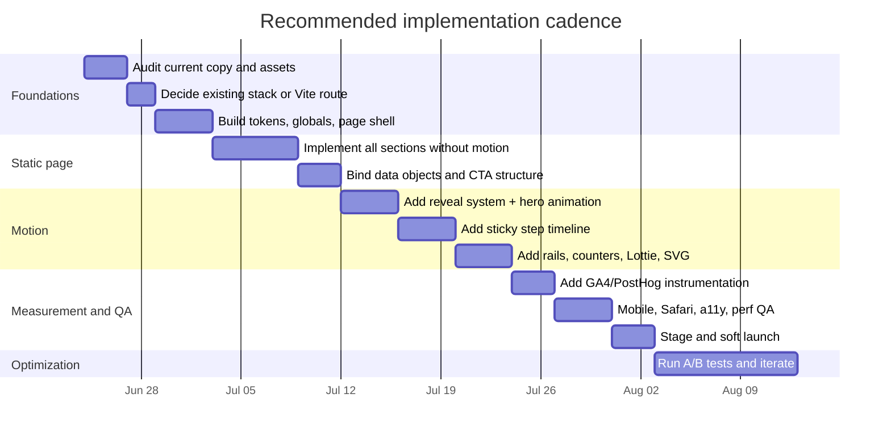

# Deep Research Report on a New Motion-Forward Influencer Page for SeeTusk

## Executive summary

SeeTusk already has a strong editorial voice: the homepage frames the agency as a “brand-building and distribution company” for ambitious brands, the influencer page clearly diagnoses wasted spend and lays out campaign archetypes with pricing anchors, and the web page demonstrates a more mature proof-and-stack story with case studies, metrics, productized tools, and an explicit “Code Meets Movement” section. The opportunity is not to reinvent the brand, but to upgrade the influencer vertical so it feels as sophisticated, measurable, and motion-forward as the rest of the studio. Right now, the influencer page reads clearly but behaves more like a strong text-first service page than a flagship creative experience. citeturn1view1turn2view0turn3view0turn1view2

The benchmark set by leading creator agencies and platforms is more ambitious. Pages from Influencer.com, Goat, Whalar, Billion Dollar Boy, Viral Nation, Later, Aspire, CreatorIQ, and Modash combine stronger proof systems, richer media presentation, denser social proof, visible product demos, and more layered storytelling. Several of them also surface product or dashboard metaphors, repeated motion cues, video or demo-led sections, and stronger segmentation for brands versus creators. That gives SeeTusk a clear direction: build an **editorial-performance hybrid** page that marries cinematic creative language with measurable operator credibility. citeturn21view0turn22view0turn22view2turn21view1turn22view1turn23view3turn21view4turn21view3turn23view0

The recommended page concept is a **scroll-led, story-driven influencer landing page** built in React with progressive motion layers: a kinetic hero, sticky process storytelling, dashboard-style proof sections, roster/category exploration, case-study cards, and a strong CTA funnel. For motion, the safest high-impact stack is **GSAP + ScrollTrigger** for scroll scenes, **Lottie** for compact explainer loops, **native SVG animation** for emblem/logo motion, and **Intersection Observer** or Motion for lightweight reveal systems. Motion should default to transform/opacity-based animation for performance, and every non-essential effect should degrade for users who prefer reduced motion. citeturn10search0turn28view0turn10search5turn13search1turn13search4turn28view2turn27view1turn26view2turn19search14turn14search1turn26view3

Assumptions used throughout this report are limited and explicit: no locked formal brand guideline was provided; the current visual language appears monochrome, typography-first, and editorial; the most likely target audience is founders, CMOs, and brand teams in India; and the primary business goal is more qualified inbound project conversations rather than creator self-signup. Those assumptions are derived from the current site copy and market positioning, not invented from scratch. citeturn1view1turn2view0turn18search8

## Current SeeTusk audit

### What is currently working

SeeTusk’s current site architecture is already coherent. The homepage positions the company around “content, creators, and code,” emphasizes ambitious brands, and uses sparse, editorial sectioning. The influencer page follows that same verbal system, with a strong opening problem frame, campaign archetypes, creator tiers, and pricing anchors. The web page is the strongest existing reference: it pairs concise positioning with case studies, outcome metrics, stack transparency, analytics language, and a visible motion thesis through “ASCII Motion.” That means the new influencer page should feel like a **sibling** of the web page rather than a disconnected redesign. citeturn1view1turn2view0turn3view0turn1view2

The influencer page’s strongest content decisions are the clear statement of the operational problem, the “performance marketer” framing, the four campaign archetypes, and the city/tier-based roster scaffolding. These are unusually concrete compared with many generic agency pages and should absolutely be preserved. citeturn2view0turn3view0

### What appears limited or underdeveloped

The present influencer page appears lighter on proof, denser motion, and productization than the web vertical. The parser surfaces no obvious video element on the influencer page, and it does not expose any visible runtime/library hints from that page through this interface. By contrast, the web page explicitly advertises motion, analytics wiring, performance, case results, and internal tooling such as Roster and Brandscope. In other words, the influencer page currently sells the service logic, but not yet the *full system* around that service. citeturn4view1turn4view3turn1view2

The gap is especially noticeable in three areas. First, proof density: the influencer page discusses live dashboards and accountability but does not show a dashboard preview, quantified outcomes, or case-study cards comparable to the web page. Second, media richness: the roster section includes imagery, but it reads more like static gallery support than a differentiated interactive experience. Third, conversion architecture: the page has clear CTAs, but it lacks intermediate conversion devices such as sticky demo prompts, downloadable benchmark assets, or segmented CTA paths for “Launch a campaign,” “See a sample dashboard,” and “Request roster access.” citeturn2view0turn3view0turn1view2

### Audit summary

| Page | What is evident on the live page | Strengths | Gaps relative to best-in-class | Implication for the new page |
|---|---|---|---|---|
| `seetusk.com` | Editorial positioning around “content, creators, and code,” ambitious brands, and clear agency narrative. citeturn1view1 | Strong voice; clear target audience; established monochrome/editorial tone. | More brand story than service-specific persuasion. | Preserve tone and section architecture. |
| `seetusk.com/influencer` | Problem framing, method, campaign archetypes, creator tiers, pricing anchors, roster imagery. citeturn2view0turn3view0 | Excellent strategic clarity; helpful packages; concrete roster logic. | Less proof, fewer interactive moments, no surfaced video/demo cues in parser. citeturn4view3 | Turn this into a flagship narrative plus proof engine. |
| `seetusk.com/web` | Motion thesis, metrics, case studies, stack transparency, analytics instrumentation, in-house tools. citeturn1view2 | Best current template for proof + motion + “operator” credibility. | More mature than influencer page, creating cross-site asymmetry. | Borrow this page’s proof density and product framing. |
| `seetusk.com/contact` | Clear “start a project” framing and one-call CTA. citeturn18search8 | Strong low-friction contact proposition. | No specialized influencer pre-qualification path visible in snippet. | Add influencer-specific lead routing and event tracking. |

### What could not be fully inspected

I was able to inspect publicly rendered page text, structure, and some media cues from the live site. I could **not** reliably inspect DevTools-only details such as JavaScript bundles, exact frontend framework in production, runtime animation libraries, or Core Web Vitals measurements from the origin environment through this interface. That matters because some motion-related recommendations below are based on visible behavior and architectural fit, not bundle-level reverse engineering.

## Competitive benchmark and inspiration set

The tables below prioritize official/primary pages. In the “Official page / URL” column, the path is shown in code formatting for readability, and the citation opens the live source. The “Tech used” column is intentionally conservative: if the frontend stack is not publicly disclosed on the official page, it is labeled **not publicly disclosed** or **likely custom**.

### Influencer and creator marketing benchmarks

| Official page / URL | Standout features | Observed animation types | Observed / likely tech signals | UX patterns worth borrowing | Inspiration notes |
|---|---|---|---|---|---|
| `influencer.com` — Influencer.com home citeturn21view0 | Creator-first global positioning with agency + technology split. | Likely polished hero transitions and content reveals; parser surfaced image-led hero, but not implementation detail. | Not publicly disclosed. | Strong “agency + technology + work” nav, premium enterprise framing. | Good model for a sharp hero plus platform credibility without losing agency tone. |
| `goatagency.com/influencer-marketing-agency` — Goat citeturn22view0 | Awards, verticalized case imagery, multiple service pathways such as activations, commerce, ambassadors. | Heavy image-led reveal system; likely hover/card transitions. | Not publicly disclosed. | Social proof high on page, service branching, case-card rhythm. | Borrow the density of proof and sub-service segmentation. |
| `whalar.com` — Whalar home citeturn22view2 | Big manifesto-led positioning, multiple image inserts, client quotes surfaced early. | Likely cinematic hero and section transitions; parser shows many hero/support images. | Not publicly disclosed. | Manifesto + testimonials + work structure. | Useful for turning SeeTusk’s voice into a more culture-forward narrative without losing business clarity. |
| `billiondollarboy.com/solutions` — BDB solutions citeturn21view1 | Social-first growth framing with visible “Creators / Campaigns / Ambassadors / Ecosystems” taxonomy and repeated play states. | Video-led tiles or embedded media controls are strongly implied by repeated PLAY/STOP states. | Likely custom front-end; public stack undisclosed. | Media-rich category cards, modular solution architecture. | Excellent reference for video-backed solution blocks and dynamic storytelling. |
| `viralnation.com/services/influencer-marketing` — Viral Nation citeturn22view1 | Strong metrics framing: annual creator spend, vertical breadth, ROAS/CAC impact. | Metrics-led motion is likely; parser emphasizes numeric proof. | Not publicly disclosed. | Enterprise proof strip, ROI language, scale reassurance. | Strong benchmark for SeeTusk’s “tracked, accountable” proposition. |
| `ubiquitousinfluence.com/how-it-works` — Ubiquitous citeturn21view5 | Large network numbers and process framing designed for brand-side clarity. | Likely lightweight count-up / reveal behaviors around stats. | Powered by Humanz is stated on home; specific page stack undisclosed. citeturn7search0 | Very clear “for brands” path and capability explanation. | Good model for simplifying complex services into brand-friendly steps. |
| `theinfluencermarketingfactory.com` — The Influencer Marketing Factory citeturn21view6 | Revenue-first messaging, simple platform list, large outcome metrics. | Visual emphasis appears lighter but still conversion-oriented. | Not publicly disclosed. | Clear funnel language and immediate credibility stats. | Useful when SeeTusk wants a leaner, more direct conversion section. |
| `sociallypowerful.com/.../instagram` — Socially Powerful Instagram agency page citeturn22view7 | Channel-specific landing page tied to tracked conversions and platform-native formats. | Background imagery and likely lightweight transitions. | Not publicly disclosed. | Search-like long-tail channel pages; strong SEO/service modularity. | Good inspiration if SeeTusk later expands into TikTok/YouTube/LinkedIn subpages. |
| `creatoriq.com/influencer-marketing-solution` — CreatorIQ solution page citeturn21view3 | Strong AI-native platform positioning and unified workflow narrative. | Likely SaaS-style product motion rather than artistic motion. | Product company; likely custom app-marketing stack, not publicly disclosed. | Enterprise demo CTA, ecosystem language, “operating system” framing. | Great reference for showing dashboards, workflows, and system sophistication. |
| `later.com/influencer-marketing-platform` — Later platform page citeturn23view3 | Product demo near hero, long logo rails, decision-support story, creator discovery/reporting sections. | Demo-led hero motion, likely logo carousels, interface transitions. | Product company; stack not publicly disclosed. | Excellent “confidence at every decision point” information architecture. | One of the best references for mixing proof, product visuals, and clean modern motion. |
| `aspire.io` — Aspire home citeturn21view4 | Integration-heavy architecture, community layer, results strip, stories, marketplace split for brands/creators. | Likely logo rails, counters, card reveals, demo/support imagery. | Product company; stack not publicly disclosed. | Multi-audience segmentation and platform ecosystem framing. | Strong inspiration for a “service + system + creator marketplace” page model. |
| `modash.io` — Modash home citeturn23view0turn22view3 | Dense product IA, workflow-by-use-case navigation, affiliate/gifting/paid segmentation, API story. | Likely app-like microinteractions; parser shows dense image and product navigation structure. | Platform company; docs/API suggest product-led custom stack, but exact frontend is undisclosed. | Use-case tabs, modular workflow blocks, API/platform trust. | Good reference for SeeTusk if it wants to showcase internal IP like Roster. |
| `grin.co` — GRIN home citeturn23view2turn22view4 | Brand-vs-creator split, AI assistant angle, discovery-to-payment workflow. | Likely card transitions and product screenshot reveals. | Product company; not publicly disclosed. | Explicit audience switching, workflow completeness. | Good model for switching between “For brands” and “For creators” experiences. |
| `captiv8.io` — Captiv8 home citeturn22view5 | Unified suite language: discovery, workflow, amplification, measurement, commerce integrations. | Light product-marketing motion; parser mostly surfaces architecture blocks. | Product company; not publicly disclosed. | Suite architecture and commerce linkage. | Useful reference for describing SeeTusk’s live dashboard, payouts, and CRM-like capabilities. |
| `fohr.co` — Fohr home citeturn23view1 | Very strong performance/predictive framing, brand-creator pair gallery, large concise metrics. | Likely restrained motion with strong scrolling reveals. | Not publicly disclosed. | High-confidence headline, compact proof, creator-brand pairing display. | Excellent for a tighter, more premium leadership voice. |
| `grynow.in` — Grynow home citeturn25view0 | Video-supported hero, massive metric wall, AI dashboard messaging, India relevance, many case studies and service variants. | Hero video is explicit; likely count-up metrics and carousel/logo motion. | Not publicly disclosed. | India-first credibility, large social proof, service breadth. | Especially relevant because SeeTusk is India-based and selling to Indian brands. |
| `creative-garage.in/services/influencer-marketing` — Creative Garage influencer services citeturn25view1 | Brand-storytelling framing with Mumbai relevance and simple positioning. | Motion not obvious from parser; appears lighter and more editorial. | Not publicly disclosed. | Clear message hierarchy, service tone. | Good regional tone reference, though less ambitious in motion than global benchmarks. |

### Motion-led agency references for pure visual inspiration

| Official page / URL | Why it matters | Borrowable motion vocabulary | Caution |
|---|---|---|---|
| `resn.co.nz` — Resn citeturn20search0turn20search15 | Longstanding creative digital agency known for highly interactive experiences. | Experimental hero motion, immersive transitions, unexpected interaction moments. | Use as visual inspiration only; do not copy its likely complexity or load profile. |
| `activetheory.net` — Active Theory citeturn20search1turn20search16 | Officially frames itself around story, art, technology, and an “industry-leading web toolset.” | Cinematic 3D/WebGL-style staging, immersive section choreography. | Ideal for hero ambition, not for a whole B2B service page build. |
| `basicagency.com` — BASIC/DEPT citeturn21view9turn20search2 | Sophisticated editorial/product design agency with strong pacing and premium polish. | Clean premium transitions, type-led motion, restrained hover systems. | Best reference for a premium B2B surface that still feels modern and sharp. |

### Best pages to open first for visual inspiration

If Claude or your design/development team only reviews six references before implementation, the strongest set is **Billion Dollar Boy solutions**, **Later’s platform page**, **Goat’s influencer page**, **Fohr**, **Grynow**, and **BASIC/DEPT**. Together they cover video/media storytelling, dashboard-like credibility, service segmentation, premium restraint, India-market proof density, and polished editorial motion. citeturn21view1turn23view3turn22view0turn23view1turn25view0turn21view9

## Motion system and design recommendations

### Animation and interaction pattern matrix

The pattern library below is curated for a B2B influencer page, not for a portfolio-only site. The rule of thumb is simple: **motion should explain hierarchy, progress, proof, or affordance**. Decorative motion is acceptable only in the first screenful and only if it degrades cleanly for reduced-motion users. GSAP/ScrollTrigger, Motion, Lottie, native SVG animation, Intersection Observer, and CSS Scroll Snap all support the patterns listed here; accessibility should follow `prefers-reduced-motion`, and transform/opacity-based animation remains the safest performance baseline. citeturn10search0turn28view0turn27view1turn10search5turn13search1turn13search4turn28view2turn28view3turn19search14turn14search1turn26view2turn26view3

| Pattern | Purpose | UX benefit | Accessibility consideration | Performance trade-off | Recommended libraries | Fallback strategy |
|---|---|---|---|---|---|---|
| Hero kinetic type | Turn the first screen into a memorable value proposition. | Establishes tone immediately and makes the page feel premium. | Reduce translation distance; disable looping for reduced-motion users. citeturn19search14turn14search1 | Overly large transforms can create paint/composite pressure if layered poorly. | GSAP or Motion. citeturn10search0turn27view1 | Static headline with subtle opacity fade only. |
| Scroll parallax | Add depth to hero imagery, roster media, or dashboard layers. | Makes long-form reading feel less flat and more cinematic. | Parallax can trigger discomfort; remove for `reduce` users. citeturn26view3 | Easy to overdo; mobile battery/jank risk if too many layers move. | GSAP ScrollTrigger or Motion `useScroll`. citeturn10search0turn13search5 | Replace with fixed-position stacking or non-moving layers. |
| Reveal-on-scroll | Stage copy, cards, and proof chunks progressively. | Improves readability and pacing. | Keep durations short and avoid surprise motion from large offsets. | Low if implemented with opacity/transform only. citeturn26view2 | Intersection Observer, Motion `useInView`, or ScrollTrigger. citeturn28view2turn27view1turn10search0 | Show content immediately with no JS dependency. |
| Sticky storytelling section | Pin a section while supporting panels or visuals update. | Ideal for “How we run campaigns” and “What the dashboard tracks.” | Give keyboard users logical reading order; avoid trapping focus. | Pinned sections can feel heavy on low-end devices if packed with media. | ScrollTrigger pinning. citeturn10search0 | Conventional stacked sections with anchor links. |
| Horizontal scroll gallery | Showcase creator categories, campaign artifacts, or case studies. | Breaks vertical monotony and makes assets feel curated. | Provide alternate swipe/arrow controls and avoid forced long horizontal drags. | Requires careful touch handling and strong snap behavior. | CSS Scroll Snap, optionally enhanced with GSAP/Motion. citeturn28view3turn27view1 | Standard swipe carousel or 2-up/3-up responsive grid. |
| Lottie explainer loops | Animate icons or short process thumbnails without full video weight. | High polish for dashboard, workflow, or brief-to-report moments. | Pause if not essential; ensure motion is not the only carrier of meaning. | Usually lighter than video, but lots of simultaneous Lotties still add cost. | Lottie Web or React Lottie wrappers. citeturn10search5turn19search4 | Static SVG/PNG frame. |
| SVG morph or line-draw | Animate logo mark, arrows, timelines, or data paths. | Gives brand-specific motion language without giant assets. | Ensure the end state is always visible; do not rely on motion to explain meaning. | Very efficient if SVGs are clean; complex paths can become tedious to maintain. | Native SVG `<animate>` / `<animateTransform>` or GSAP SVG plugins. citeturn13search1turn13search4turn13search6 | Static SVG with simple hover opacity change. |
| Cursor follower / magnetism | Add playful premium detail in hero or gallery-only zones. | Increases delight for desktop users. | Disable on touch and reduced-motion; never hide the native cursor for core flows. | Can become distracting; avoid on forms and CTAs. | Motion Cursor, GSAP, or plain JS with `requestAnimationFrame`. citeturn27view1turn19search3 | Default cursor plus hover-state styling. |
| Split-screen transitions | Compare “wasted influencer spend” vs “SeeTusk system” or “before/after.” | Strong narrative contrast and easier scanning. | Ensure reading order remains sensible on mobile and screen readers. | More layout complexity than visual cost. | CSS + GSAP/Motion. citeturn10search0turn27view1 | Collapse to stacked mobile cards. |
| Video background or cinemagraph | Add real campaign energy to hero or case-study intro. | Fast emotional impact and social-native feel. | Must be muted, non-essential, and replaceable; never depend on autoplay for comprehension. | Video is expensive if unoptimized; impacts LCP and bandwidth. citeturn14search3turn14search21turn11search16 | Native video with lazy-loading; static poster fallback. |
| Dynamic counters | Reinforce proof: creators onboarded, tracked campaigns, dashboard metrics. | Makes stats feel live and measurable. | Announce final values in DOM text; avoid rapid distracting tick motion. | Very low if triggered once. | GSAP, Motion AnimateNumber, or plain JS. citeturn10search16turn27view1 | Static numbers. |
| Microinteractions on cards and CTAs | Improve tactility of tiles, filters, and buttons. | Makes the page easier to navigate and feel less flat. | Keep hover-only effects supplementary; maintain visible focus states. | Low if limited to transform, shadow, opacity. citeturn26view2turn14search0 | CSS transitions, Motion, or lightweight GSAP. | Static states with accessible hover/focus styles. |
| Logo ticker / trust marquee | Surface clients, cities, platforms, creator niches, or partner badges. | Packs social proof into a compact strip. | Pause or reduce motion for `prefers-reduced-motion`; avoid unreadably fast marquees. citeturn26view3 | Continuous motion can be annoying if not speed-limited. | CSS animation, GSAP ticker, Motion ticker patterns. citeturn19search21turn27view1 | Static responsive logo wall. |

### Recommended design direction for SeeTusk

The strongest creative direction is a **hybrid of premium editorial layout and analytics-dashboard credibility**. That means preserving SeeTusk’s current numbered sections, sparse typography, bold value statements, and monochrome atmosphere, while adding more visible operator proof: dashboards, metrics strips, tracked-link callouts, case highlights, creator categories, and workflow motion. This fits both the homepage’s editorial system and the web page’s more technical credibility layer. citeturn1view1turn1view2turn2view0

A practical page skeleton would be:

1. **Hero:** kinetic headline, short subhead, stacked CTAs, moving proof strip.  
2. **The waste problem:** split-screen or sticky story showing failure modes.  
3. **How SeeTusk fixes it:** pinned process timeline with tracked links/contracts/dashboard visuals.  
4. **Campaign archetypes:** dynamic cards with hover or click expansion.  
5. **Roster and category fit:** filterable creator/category/city grid with portrait/video stills.  
6. **Proof layer:** sample dashboard, case metrics, testimonial quotes, client logos.  
7. **Motion-rich case studies:** horizontal scroller or alternating showcases.  
8. **FAQ + CTA:** “Request a campaign plan,” “See a sample report,” or “Book a strategy call.”  

That structure aligns with both current SeeTusk messaging and the strongest benchmark patterns. citeturn2view0turn3view0turn1view2turn23view3turn23view1

### Typography, color, contrast, and motion guidance

Typography should remain **bold, condensed or display-led for major headlines**, paired with a restrained high-legibility body face. Because the current site already feels typography-first, the redesign should amplify type hierarchy rather than bury it under 3D gimmicks. Color should stay mostly monochrome or near-monochrome, with one accent color reserved for motion highlights, filters, data points, and active states. All text should meet WCAG contrast guidance of at least 4.5:1 for normal text and 3:1 for large text. citeturn1view1turn2view0turn14search0turn14search14

Motion guidance should be simple and consistent: short microinteractions, medium reveal timing, and slower, more cinematic hero or pinned storytelling scenes. Platform systems like Material explicitly frame motion around easing, duration, and spatial relationships, which is the right philosophy here even if SeeTusk’s style remains more editorial than product-UI-like. For implementation, treat the following as **assumed working defaults**, not fixed brand law: microinteractions around 120–220 ms, reveal transitions around 350–700 ms, and hero/pinned transitions around 700–1200 ms. Preserve opacity changes even when transform motion is reduced. citeturn14search2turn14search20turn26view2turn19search2

### Content strategy recommendations

The current influencer page is already strong on logic. The next step is to make it stronger on **evidence**. The page should not only say “tracked links, codes and UTMs” and “one report, live dashboard”; it should **show** a sample dashboard module, a report snapshot, creator content thumbnails, a case-study highlights rail, and “what gets measured” tiles. That matters because top benchmarks increasingly sell not just talent access, but systems, intelligence, attribution, and workflow clarity. citeturn2view0turn3view0turn21view3turn23view3turn21view4turn23view0

The recommended content blocks for the new page are:

- **Brand-side CTA copy:** “Launch a creator campaign,” “See a sample dashboard,” “Request roster access.”  
- **Social proof:** selected client logos, creator niches, city coverage, awards or notable campaigns.  
- **Proof modules:** metric chips, case-study cards, testimonial pull quotes, live-dashboard preview.  
- **Creator/roster content:** city filters, vertical filters, creator tier selector, “fit, not follower count” explanation.  
- **Sales enablement:** FAQ, sample process diagram, expected reporting cadence, contract rights clarification.  

Those recommendations are directly responsive to what high-performing peers show publicly and to the current gaps on SeeTusk’s influencer page. citeturn22view0turn21view1turn22view1turn23view1turn25view0

## Technical architecture and implementation guide

### Recommended implementation approach

Because SeeTusk’s own web page says its custom-build stack centers on **Next.js / React / TypeScript**, while also using Vercel / Cloudflare / AWS and analytics instrumentation from day one, the lowest-friction route is to implement the new influencer page inside the existing React-based production stack **if that codebase is available**. If the page must instead be shipped as a narrowly scoped microsite or fast rebuild in JavaScript-only React, **Vite + React** is the best greenfield setup. React explicitly supports lazy-loading components, and Vite supports production chunking and asset handling suitable for a media-rich page. citeturn1view2turn30view0turn15search0turn15search3turn15search4

My recommendation for Claude is therefore:

- **Preferred path:** existing Next/React codebase → new route/page component.  
- **Fallback path:** Vite + React (JavaScript, not TypeScript) → static deployment, then integrate inside the main site later.  

### React component map

A clean component breakdown for this project would look like this:

```text
src/
  app/
    InfluencerPage.jsx
  components/
    layout/
      SiteHeader.jsx
      StickyProgressNav.jsx
      FooterCTA.jsx
    hero/
      HeroKinetic.jsx
      HeroProofTicker.jsx
    story/
      WasteProblemSplit.jsx
      ProcessStickyTimeline.jsx
      DashboardPreview.jsx
    campaigns/
      CampaignArchetypeGrid.jsx
      CampaignArchetypeCard.jsx
    roster/
      RosterFilters.jsx
      RosterGallery.jsx
      CreatorTierTabs.jsx
    proof/
      MetricsStrip.jsx
      CaseStudyRail.jsx
      TestimonialsWall.jsx
      ClientLogoTicker.jsx
    conversion/
      FAQAccordion.jsx
      LeadFormPanel.jsx
      CTAStack.jsx
    motion/
      LottieScene.jsx
      SvgAccentMark.jsx
      RevealInView.jsx
      HorizontalSnapRail.jsx
  hooks/
    useReducedMotion.js
    useInViewOnce.js
    useScrollScene.js
    useTickerPause.js
  lib/
    gsapClient.js
    analytics.js
    jqueryBridge.js
    contentAdapter.js
  data/
    influencerPageContent.js
    caseStudies.js
    creatorTiers.js
    logos.js
    faq.js
  styles/
    tokens.css
    globals.css
    utilities.css
    layout.module.css
    hero.module.css
    story.module.css
    proof.module.css
    roster.module.css
    conversion.module.css
  assets/
    lottie/
    svg/
    video/
    images/
```

For state, keep it intentionally small. This page does **not** need Redux or a heavy global store. Use local `useState` for card expansion, active filter, active rail item, and modal state. Use one lightweight context only if you need cross-page control for things like a **global reduced-motion toggle**, active progress-nav section, or analytics user state. For third-party systems or imperative plugins, React’s documented model is to synchronize with them via `useEffect`, not to let them freely mutate React-owned DOM. citeturn30view1

### Component relationship diagram

```mermaid
flowchart TD
    A[InfluencerPage] --> B[HeroKinetic]
    A --> C[WasteProblemSplit]
    A --> D[ProcessStickyTimeline]
    A --> E[CampaignArchetypeGrid]
    A --> F[RosterGallery]
    A --> G[MetricsStrip]
    A --> H[CaseStudyRail]
    A --> I[TestimonialsWall]
    A --> J[FAQAccordion]
    A --> K[LeadFormPanel]

    B --> B1[HeroProofTicker]
    D --> D1[DashboardPreview]
    F --> F1[RosterFilters]
    F --> F2[CreatorTierTabs]
    H --> H1[HorizontalSnapRail]

    A --> M[Motion Layer]
    M --> M1[GSAP ScrollTrigger]
    M --> M2[LottieScene]
    M --> M3[SvgAccentMark]
    M --> M4[RevealInView]

    A --> N[Data Layer]
    N --> N1[caseStudies.js]
    N --> N2[creatorTiers.js]
    N --> N3[faq.js]

    A --> P[Analytics]
    P --> P1[GA4]
    P --> P2[PostHog]
```



### CSS architecture recommendation

Use a **hybrid CSS strategy**:

- **CSS Modules** for section/component scoping inside React. CSS Modules scope class names locally by default, which is excellent for a large motion-heavy page with many nested variants. citeturn30view2
- **BEM-style naming inside component styles** for clarity when sections get more complex, especially for motion states like `hero__headline--entered` or `proofCard--active`. BEM remains useful for larger collaborative projects and long-term maintainability. citeturn29view3
- **Global utility classes** only for spacing/layout helpers such as `.u-container`, `.u-grid`, `.u-visually-hidden`, `.u-stack-xl`.
- **Design tokens in plain CSS variables** for spacing, easing, z-index, color, radius, and timings.

A practical rule: keep layout and tokens global, keep section visuals local, and keep motion state classes explicit.

### jQuery integration points

If jQuery is truly required, use it **sparingly and in isolation**. React’s guidance is to synchronize external systems through Effects, and jQuery’s own DOM-ready/effects model is imperative. That means jQuery should only initialize plugins against a `ref`-owned island that React does not constantly re-render. Good use cases are a legacy form enhancer, an old lightbox, or a third-party carousel that you do not want to rewrite immediately. Poor use cases are scroll scenes, pinned layouts, or card state that React already owns. citeturn30view1turn16search2turn16search3turn16search11

A safe bridge pattern looks like this:

```jsx
import { useEffect, useRef } from "react";
import $ from "jquery";

export default function LegacyMarqueeBridge() {
  const rootRef = useRef(null);

  useEffect(() => {
    const $root = $(rootRef.current);

    // Example: initialize legacy plugin on a DOM island.
    // $root.someLegacyPlugin({ speed: 30 });

    return () => {
      // Example: cleanup if the plugin supports destroy.
      // $root.someLegacyPlugin("destroy");
    };
  }, []);

  return <div ref={rootRef} className="legacy-marquee-root" />;
}
```

Recommended policy for Claude: **prefer React + GSAP/Motion for all new motion**, and reserve jQuery for strictly legacy or third-party enhancement needs.

### Build and performance strategy

This page will only feel premium if it stays fast. React `lazy()` defers component code until first render, and Vite supports chunking strategy control at build time. Use that to split the page into logical groups: hero motion, roster/gallery, case-study rail, and lead-form/analytics. citeturn30view0turn15search0turn15search2

The performance baseline should be:

- Lazy-load noncritical sections and modals with `React.lazy()` and `<Suspense>`. citeturn30view0  
- Lazy-load below-the-fold images with native `loading="lazy"`. citeturn11search0turn11search4  
- Serve media in modern formats such as AVIF/WebP where appropriate. citeturn12search3turn12search7  
- Preload only the true critical assets: hero font, hero background image/poster, and perhaps one above-the-fold Lottie JSON if it is essential. Over-preloading is counterproductive. citeturn12search2turn12search10  
- Use video only where it clearly outperforms a static poster, and lazy-load it if it is not hero-critical. citeturn14search3turn14search21turn11search16  
- Favor `transform` and `opacity` for animation, and use `requestAnimationFrame` only when you truly need custom JS-driven loops. citeturn26view2turn19search3  
- Separate heavy animation CSS or motion modules for non-reduced-motion users if needed. citeturn26view3  

### Step-by-step implementation milestones for Claude

| Milestone | Core objective | Tasks Claude should execute | Effort |
|---|---|---|---|
| Discovery and page definition | Lock scope and content architecture before coding. | Extract current SeeTusk copy blocks worth preserving; define target sections; identify required assets; confirm whether build target is existing React/Next codebase or new Vite app. | Medium |
| Scaffold and foundations | Build the page shell and design system. | Create route/page, tokens, CSS reset, container/grid utilities, motion-safe base classes, reduced-motion helper, analytics wrapper, and section placeholders. | Medium |
| Static content build | Ship the no-motion page first. | Implement hero, problem section, campaign archetypes, roster filters, proof strip, case cards, FAQ, CTA, footer; bind all content from local data objects rather than hardcoding strings into components. | High |
| Motion pass one | Add the highest-value motion only. | Add hero kinetic type, reveal-on-scroll system, sticky process timeline, count-up metrics, and subtle card hover microinteractions. | High |
| Motion pass two | Add premium polish selectively. | Add horizontal snap case-study rail, Lottie explainer, SVG accent animation, optional cursor treatment for desktop hero only, and logo ticker. | Medium |
| Conversion and instrumentation | Ensure the page sells, not just dazzles. | Implement CTA variants, form tracking, section view events, case-study interaction events, reduced-motion logging, and lead tagging. | Medium |
| QA and launch hardening | Make it deployable. | Audit mobile, Safari, reduced-motion mode, keyboard navigation, CLS/LCP risk, fallback states, and staging instrumentation before rollout. | High |

### Recommended build order inside each milestone

Claude should implement in this exact sequence:

1. **Build a fully readable static page first.**  
2. Layer in **reveal-on-scroll and hero motion**.  
3. Add the **sticky timeline**.  
4. Add **proof/dashboards/case-study interactions**.  
5. Add only then the **decorative enhancements** such as cursor play or tickers.  
6. Finally, instrument analytics and A/B testing hooks.  

That order prevents motion work from blocking layout, content, or conversion logic.

### Key code snippets

#### React with GSAP and ScrollTrigger for a pinned process section

```jsx
// ProcessStickyTimeline.jsx
import { useRef } from "react";
import gsap from "gsap";
import { ScrollTrigger } from "gsap/ScrollTrigger";
import { useGSAP } from "@gsap/react";

gsap.registerPlugin(ScrollTrigger, useGSAP);

export default function ProcessStickyTimeline() {
  const rootRef = useRef(null);

  useGSAP(
    () => {
      const panels = gsap.utils.toArray(".timeline-panel");

      gsap.from(".timeline-title", {
        y: 40,
        opacity: 0,
        duration: 0.8,
        ease: "power2.out",
      });

      panels.forEach((panel, index) => {
        gsap.from(panel, {
          y: 30,
          opacity: 0,
          duration: 0.5,
          ease: "power2.out",
          scrollTrigger: {
            trigger: panel,
            start: "top 75%",
            toggleActions: "play none none reverse",
          },
          delay: index * 0.05,
        });
      });

      ScrollTrigger.create({
        trigger: ".timeline-track",
        start: "top top",
        end: "bottom bottom",
        pin: ".timeline-sticky-visual",
        scrub: 0.5,
      });
    },
    { scope: rootRef }
  );

  return (
    <section ref={rootRef} className="timeline">
      <div className="timeline-grid">
        <div className="timeline-copy">
          <h2 className="timeline-title">How creator campaigns become measurable</h2>

          <article className="timeline-panel">
            <h3>Brief and fit</h3>
            <p>Choose creators by fit, city, niche, and campaign intent.</p>
          </article>

          <article className="timeline-panel">
            <h3>Contract and tracking</h3>
            <p>Issue rights, UTMs, codes, and milestones before posting starts.</p>
          </article>

          <article className="timeline-panel">
            <h3>Live dashboard</h3>
            <p>Watch reach, clicks, code redemptions, and attributed revenue update in one place.</p>
          </article>
        </div>

        <div className="timeline-sticky-visual">
          <div className="timeline-track">
            <div className="dashboard-mock">Dashboard preview</div>
          </div>
        </div>
      </div>
    </section>
  );
}
```

GSAP’s React guidance is especially relevant here because `useGSAP()` is designed as a React-friendly replacement for Effects and automatically handles cleanup of animations and ScrollTriggers when the component unmounts. ScrollTrigger itself is built specifically for pinning, scrubbed scroll scenes, and scroll-triggered motion. citeturn28view0turn28view1turn10search0

#### React Lottie integration for a compact explainer animation

```jsx
// LottieScene.jsx
import { Player } from "@lottiefiles/react-lottie-player";

export default function LottieScene({
  src,
  title = "Animated explainer",
  autoplay = true,
  loop = true,
}) {
  const prefersReducedMotion =
    typeof window !== "undefined" &&
    window.matchMedia("(prefers-reduced-motion: reduce)").matches;

  return (
    <div className="lottie-scene" aria-label={title}>
      <Player
        autoplay={autoplay && !prefersReducedMotion}
        loop={loop && !prefersReducedMotion}
        src={src}
        keepLastFrame
        style={{ width: "100%", maxWidth: "420px", height: "auto" }}
      />
    </div>
  );
}
```

Lottie is a web-capable animation format/library for rendering After Effects exports as JSON, and React wrappers expose the player cleanly in component form. The accessibility requirement is to stop non-essential looping motion for reduced-motion users. citeturn10search5turn19search4turn19search14

#### Native SVG accent animation for the SeeTusk mark or arrows

```html
<svg
  width="180"
  height="180"
  viewBox="0 0 180 180"
  role="img"
  aria-label="Animated brand accent"
>
  <circle cx="90" cy="90" r="54" fill="none" stroke="currentColor" stroke-width="2">
    <animate
      attributeName="stroke-dasharray"
      from="0 339"
      to="339 0"
      dur="1.8s"
      fill="freeze"
    />
  </circle>

  <g transform="translate(90 90)">
    <rect x="-18" y="-18" width="36" height="36" fill="currentColor">
      <animateTransform
        attributeName="transform"
        type="rotate"
        from="0"
        to="90"
        dur="1.2s"
        fill="freeze"
      />
    </rect>
  </g>
</svg>
```

Native SVG animation is a strong choice for light brand-specific motion, especially for accent graphics, arrows, dividers, and line-draw effects. MDN documents native SVG animation elements such as `<animate>` and `<animateTransform>`, which are widely supported. citeturn13search1turn13search7

#### CSS scroll snap for a case-study rail

```css
.case-rail {
  display: grid;
  grid-auto-flow: column;
  grid-auto-columns: 88%;
  gap: 1rem;
  overflow-x: auto;
  padding: 0 1rem 1rem;
  scroll-snap-type: x mandatory;
  scroll-padding-inline: 1rem;
}

.case-card {
  scroll-snap-align: start;
  border: 1px solid rgba(255,255,255,0.12);
  border-radius: 20px;
  padding: 1.25rem;
  min-height: 24rem;
}

@media (min-width: 900px) {
  .case-rail {
    grid-auto-columns: 42%;
  }
}
```

```jsx
<div className="case-rail" aria-label="Featured case studies">
  {cases.map((item) => (
    <article key={item.id} className="case-card">
      <h3>{item.title}</h3>
      <p>{item.summary}</p>
    </article>
  ))}
</div>
```

CSS Scroll Snap is built for scroll containers that need controlled snap positions and works well for horizontal case rails on mobile and desktop. citeturn28view3turn11search7turn11search11

#### Intersection Observer for low-cost reveal-on-scroll

```jsx
// RevealInView.jsx
import { useEffect, useRef, useState } from "react";

export default function RevealInView({ children, className = "" }) {
  const ref = useRef(null);
  const [shown, setShown] = useState(false);

  useEffect(() => {
    const node = ref.current;
    if (!node) return;

    const observer = new IntersectionObserver(
      ([entry]) => {
        if (entry.isIntersecting) {
          setShown(true);
          observer.unobserve(node);
        }
      },
      { threshold: 0.15, rootMargin: "0px 0px -10% 0px" }
    );

    observer.observe(node);
    return () => observer.disconnect();
  }, []);

  return (
    <div
      ref={ref}
      className={`${className} reveal ${shown ? "is-visible" : ""}`}
    >
      {children}
    </div>
  );
}
```

```css
.reveal {
  opacity: 0;
  transform: translateY(24px);
  transition: opacity 500ms ease, transform 700ms ease;
}

.reveal.is-visible {
  opacity: 1;
  transform: translateY(0);
}

@media (prefers-reduced-motion: reduce) {
  .reveal,
  .reveal.is-visible {
    opacity: 1;
    transform: none;
    transition: none;
  }
}
```

Intersection Observer is widely available and specifically designed to observe changes in element visibility asynchronously, making it ideal for reveal systems and lazy behavior without scroll event spam. citeturn28view2turn19search14

### Testing checklist

| Area | What to test | Pass criteria |
|---|---|---|
| Layout | Mobile widths, tablet, wide desktop, ultrawide | No overlap, no horizontal overflow, no illegible text blocks |
| Motion | Hero, pinned section, reveals, counters, rail | Smooth on modern devices, no stuck pinned states, no double-fire on re-render |
| Accessibility | Keyboard nav, focus order, focus visible, reduced motion, contrast | Entire page usable with keyboard; non-essential motion reduced or removed; text contrast compliant. citeturn14search0turn14search1turn19search14 |
| Performance | LCP hero asset, image laziness, video loading, bundle size | Hero renders fast; below-fold assets defer; no unnecessary autoplay offscreen. citeturn11search0turn11search4turn14search3 |
| Cross-browser | Chrome, Safari, Firefox, iOS Safari, Android Chrome | No broken sticky sections; SVG and snap rails degrade acceptably |
| Analytics | CTA clicks, section depth, form submission, case interactions | Events fire once, with clean naming and expected metadata. citeturn17search5turn17search6 |

## Rollout, experimentation, and prioritized task list

### Staging and launch plan

The safest rollout is a staged introduction under a temporary route such as an internal preview or `influencer-v2`, followed by side-by-side review against the current page. That lets the team validate copy, asset weight, reduced-motion behavior, and event instrumentation before swapping the live route. PostHog supports experiments and no-code web experiments, while GA4 supports recommended and custom events; those are the two best systems for validating whether heavy motion is helping or hurting conversion. citeturn17search2turn17search15turn17search19turn17search0turn17search5turn17search23

A practical rollout sequence is:

- Internal staging review  
- Cross-device QA  
- Analytics validation in debug mode  
- Soft launch to a traffic slice or UTM-targeted campaign  
- A/B test one motion variable at a time  
- Full route replacement only after KPI stability  

### A/B tests that are actually worth running

Not every motion choice deserves an experiment. The highest-value tests are the ones most likely to affect comprehension, trust, or form completion:

| Test idea | Variant A | Variant B | Primary metric |
|---|---|---|---|
| Hero style | Static editorial hero | Kinetic type + subtle motion proof strip | CTA click-through |
| Proof placement | Metrics below fold | Metrics inside hero / above process | Scroll depth to process section |
| Dashboard reveal | Static screenshot | Sticky interactive dashboard preview | “See sample dashboard” CTA clicks |
| Case-study treatment | Standard grid | Horizontal snap rail | Case-card interaction rate |
| CTA architecture | Single “Start a project” CTA | Three segmented CTAs | Lead generation rate |
| Cursor treatment | No custom cursor | Desktop-only cursor accent in hero | Bounce rate, CTA click-through |
| Video usage | Static poster | Muted hero cinemagraph | LCP + engagement balance |

PostHog is suitable here because it explicitly supports A/B and multivariate experiments, while GA4 can collect the primary and secondary engagement events you want to analyze. citeturn17search2turn17search15turn17search19turn17search0turn32search2

### Analytics event schema and KPIs

Use a mix of **GA4 recommended events**, **GA4 custom events**, and **PostHog autocapture + custom events**. Google recommends using standard event names where they fit, such as `generate_lead` for form capture and `select_content` for case-study or content selection, while PostHog recommends pairing autocapture with custom events for the most important actions. GTM/gtag data-layer pushes are the cleanest way to send structured page interaction data. citeturn32search2turn31search0turn17search6turn17search14turn32search6

| Event name | Platform | Trigger | Why it matters |
|---|---|---|---|
| `page_view` | GA4 + PostHog | Page load | Baseline traffic and campaign segmentation. citeturn17search1turn17search14 |
| `hero_cta_click` | GA4 custom + PostHog | Hero button click | Measures top-funnel persuasion. citeturn17search5turn17search6 |
| `select_content` | GA4 recommended | Case-card or proof-card click | Standardized content interaction measurement. citeturn31search0turn31search3 |
| `section_50_view` | GA4 custom + PostHog | User reaches 50% of page | Better than raw scroll percentage alone for campaign pages. |
| `dashboard_preview_open` | GA4 custom + PostHog | Sample report modal/expander opens | Measures proof curiosity. |
| `roster_filter_change` | GA4 custom + PostHog | City/niche/tier filter use | Indicates intent depth and audience interest. |
| `case_video_play` | GA4 enhanced/custom + PostHog | Embedded video play | Validates whether video pays its keep. citeturn31search1turn17search1 |
| `faq_expand` | PostHog custom | FAQ interaction | Helps identify objection patterns. |
| `generate_lead` | GA4 recommended | Successful form submit | Standard lead capture event for the core conversion. citeturn32search0turn32search2 |
| `lead_source_detail` | GA4 param + CRM sync | Submit metadata | Connects campaign, page version, and CTA origin. |
| `reduced_motion_user` | PostHog custom | User preference detected | Helps interpret engagement by motion cohort. |
| `experiment_variant_assigned` | PostHog | Experiment enrollment | Necessary for trustworthy experiment readouts. citeturn17search15turn17search19 |

For KPIs, track four layers:

- **Engagement:** average scroll depth, section completion, case-study interactions, dashboard preview opens.  
- **Conversion:** hero CTA CTR, mid-page CTA CTR, form completion, qualified-lead rate.  
- **Efficiency:** LCP, asset weight, video engagement versus abandonment, bounce on mobile.  
- **Commercial impact:** lead-to-call rate, call-to-proposal rate, proposal-to-close rate, win rate by page variant.  

If you later need to unify offline sales outcomes with page interactions, GA4’s Measurement Protocol is designed to augment—not replace—client-side tagging for server-side/offline events. citeturn32search4

### Prioritized task list

| Priority | Task | Why it comes first |
|---|---|---|
| Must | Keep current influencer copy logic, but rebuild the page architecture around proof, motion, and dashboard credibility. | The current page already has strong strategy; the gap is packaging and evidence. |
| Must | Build the page statically before adding advanced motion. | Prevents animation from masking layout/content issues. |
| Must | Add a live-dashboard preview section and at least three proof modules. | This is the biggest gap versus Later, BDB, Viral Nation, Aspire, and Fohr. citeturn23view3turn21view1turn22view1turn21view4turn23view1 |
| Must | Instrument GA4 + PostHog from day one. | Motion-heavy pages are impossible to judge without measurement. citeturn17search5turn17search6 |
| Must | Respect reduced-motion preferences globally. | Essential for accessibility and motion safety. citeturn19search14turn14search1turn26view3 |
| Should | Add sticky storytelling for the process section. | Highest-impact motion pattern for explaining SeeTusk’s system. |
| Should | Add a horizontal snap case-study or creator-category rail. | Helps differentiate the page visually without huge complexity. citeturn28view3 |
| Should | Add one Lottie explainer loop and one SVG brand accent. | Good polish with relatively controlled weight. citeturn10search5turn13search1 |
| Should | Create segmented CTAs such as “See sample dashboard” and “Request roster access.” | Better conversion architecture than a single generic contact path. |
| Nice to have | Desktop-only cursor accent in the hero. | Delightful, but never essential. |
| Nice to have | Video-backed hero or case intro. | Powerful if well-optimized, but easiest to overdo. citeturn14search3turn14search21 |
| Nice to have | Platform or city-specific subpages later. | Strong SEO expansion path modeled by Socially Powerful and Grynow. citeturn22view7turn25view0 |

### Suggested implementation timeline



The highest-confidence recommendation from this research is therefore straightforward: **build a premium, motion-forward, proof-heavy influencer page that visually matches SeeTusk’s strongest web vertical, but keep the motion disciplined, measurable, and accessibility-safe.** That combination—editorial drama plus operational proof—is the clearest white space between the current page and the strongest benchmarks. citeturn1view2turn23view3turn21view1turn22view1turn23view1turn19search14turn26view2